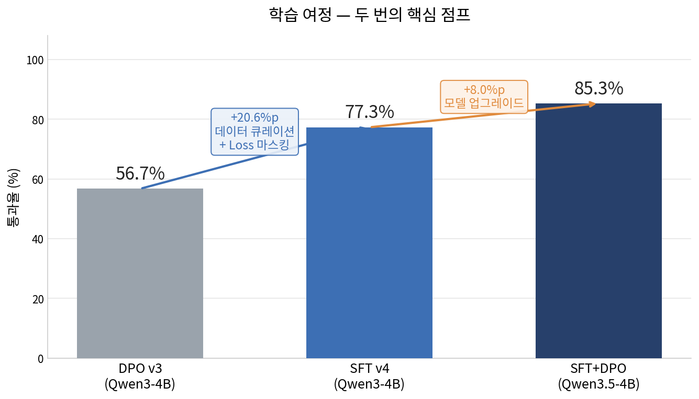
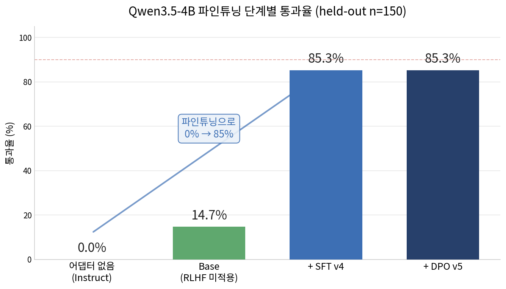
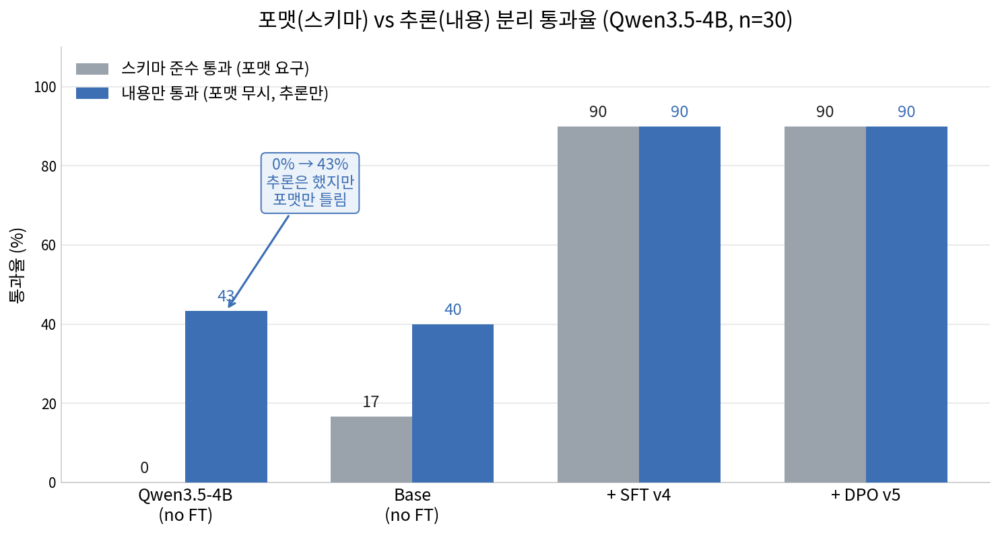
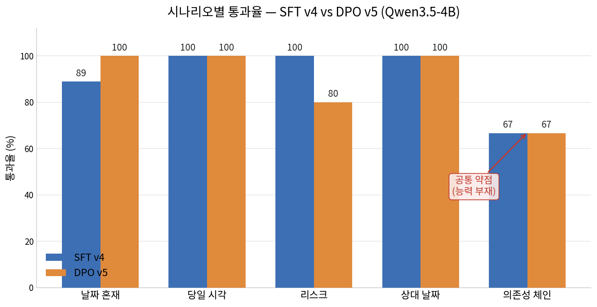

# TimeSorter — 한국어 할 일 우선순위 정렬 비서

> **Qwen3.5-4B / 9B**를 한국어 일정 관리 태스크에 특화 파인튜닝하는 SFT → DPO(→GRPO) 파이프라인.
> 사용자가 제출한 할 일 목록을 **긴급도·중요도·의존성·시간 제약** 4축으로 채점해 우선순위를 결정합니다.

---

## 프로젝트 목적

스마트폰·PC에서 "오늘 할 일"을 입력하면 AI가 맥락을 이해해 실행 순서를 제안하는 개인 비서 코어 모델을 만드는 것이 목표입니다.

단순 키워드 기반 정렬이 아닌, **페르소나**(직장인·학생·부모 등)와 **4가지 축**을 기반으로 각 태스크를 1–5점으로 채점하고 그 근거를 함께 제시합니다.

```
입력: "임원 보고서 마감(내일), 팀 회의(오후 2시), 점심 약속, 메일 답장 3건"

출력:
1) 임원 보고서 마감  [긴급5·중요5·의존4·시간2] — 내일 마감, 핵심 업무
2) 팀 회의(오후 2시) [긴급4·중요4·의존3·시간4] — 고정 시각, 후속 블로킹
3) 메일 답장 3건     [긴급4·중요3·의존2·시간1] — 긴급하나 고정 시각 없음
4) 점심 약속         [긴급2·중요2·의존1·시간3] — 유연 조정 가능
```

---

## 데이터셋 구성

### v1 — 자유 텍스트 우선순위 응답

| 파일 | 행 수 | 설명 |
|------|-------|------|
| `scheduler_ko.parquet` | 1,200 | GPT 생성 한국어 스케줄 기본 셋 |
| `scheduler_generic.parquet` | 3,000 | 다양한 일상 태스크 확장 |
| `scheduler_nemotron_r2~r4.parquet` | 각 ~2,500 | Nemotron 페르소나 기반 다양화 3라운드 |
| **`scheduler_ko_combined.parquet`** | **5,999** | v1 SFT 통합 (위 파일 병합) |

**응답 형식 (v1)**:
```
1) 보고서 마감 - 외부 고객 신뢰와 직결된 마감이라 가장 우선합니다.
2) 팀 회의 - 협업에 필수적인 정보 공유 자리입니다.
3) 운동 - 건강을 위해 중요하지만 시간 제약이 낮습니다.
```

### v2 — 4축 점수 JSON 응답

| 파일 | 행 수 | 설명 |
|------|-------|------|
| `scheduler_v2_regen.parquet` | ~6,000 | v1 데이터를 v2 JSON으로 재생성 |
| `scheduler_v2_nemotron_extra.parquet` | ~3,000 | Nemotron 페르소나 v2 추가 |
| **`scheduler_v2_combined.parquet`** | **10,958** | v2 SFT 통합 |
| `dpo_pairs_v2.parquet` | DPO용 | 선호/비선호 응답 쌍 (v2 JSON) |

**응답 형식 (v2)**:
```json
{
  "tasks": [{"id": 1, "text": "보고서 마감"}, {"id": 2, "text": "팀 회의"}],
  "priority_order": [1, 2],
  "scores": [
    {"task_id": 1, "urgency": 5, "importance": 5, "dependency": 4,
     "time_constraint": 2, "reason": "내일 마감, 고객사 핵심 업무"},
    {"task_id": 2, "urgency": 4, "importance": 4, "dependency": 3,
     "time_constraint": 4, "reason": "오후 고정 시각, 후속 작업 입력"}
  ]
}
```

### v3 — 시나리오 골격 기반 (날짜 추론·마감 세분화·의존성·리스크)

| 파일 | 행 수 | 설명 |
|------|-------|------|
| `scheduler_v3.parquet` | 1,978 | 골격 검증 통과 신규 시나리오 (today 컬럼 + meta 골격 포함) |
| **`scheduler_v3_combined.parquet`** | **5,678** | v3 신규 + v2 replay(refusal 전체 + 일반 2.5K, 랜덤 today 부여) |
| `dpo_pairs_v3.parquet` | 3,722쌍 | hard negative 5종 + v2 replay 1.5K |
| `scheduler_v3_eval.parquet` | ~150 | held-out 평가셋 (학습 seed 46과 다른 seed 47) |

### v4 — 이중 생성 경로 + 신규 시나리오 3종

v3 골격 검증 파이프라인에 Claude Code 하위 에이전트(Sonnet 4.6 / Opus 4.8) 경로를 추가.
OpenAI(gpt-5.4-mini 텍스트 + gpt-5.4 chosen)와 Claude가 같은 골격을 채우도록 병렬 실행 →
두 경로 모두 `verify_chosen()` 통과 필수(통과율 97-98%).

| 파일 | 행 수 | 설명 |
|------|-------|------|
| `scheduler_v4_extra.parquet` | 989 | OpenAI(545) + Claude(444) 병렬 생성 — v4 신규 시나리오 4종 |
| `dpo_pairs_v4_extra.parquet` | 1,978쌍 | hard negative 5종: order_score_mismatch, granularity_swap, date_confusion, past_hallucination, risk_ignore |

**v4 신규 시나리오:**

| 시나리오 | 행 수 | 핵심 학습 신호 |
|---------|------|--------------|
| `past_split` | 249 | 지난/유효 일정이 다수 혼합 — 지난 일정은 urgency=1·importance=1로 하위 배치 |
| `no_today` | 245 | 오늘 날짜 미상 — '지남' 단정 금지, 절대 날짜 있는 것끼리만 비교 |
| `dated_mixed` | 247 | 절대 날짜·시각이 혼재 — 오늘 기준 날짜 계산 + 시각 순서 동시 요구 |
| `am_escalation` | 248 | 오전 마감 + 에스컬레이션 리스크 — urgency=5 우선 처리 |

### v5 — on-policy DPO + Claude 의존성 체인 보강

v4의 residual weakness(dependency_chain 43%)를 타깃: Claude 에이전트가 **체인 시나리오 비중을 높여** 재생성하고, SFT v4(Qwen3) 모델의 **실제 출력 오류를 on-policy rejected로** 수집.

| 파일 | 행 수 | 설명 |
|------|-------|------|
| `scheduler_v5_claude.parquet` | 389 | Claude Sonnet 4.6 생성 — dependency_chain 비중 대폭 확대 |
| `dpo_pairs_v5.parquet` | 1,368쌍 | hard negative 6종 + on-policy 228쌍 + past_hallucination 36쌍 |
| `dpo_pairs_v5_onpolicy.parquet` | 351쌍 | on-policy 전용 파일 (더 많은 체인·dated 오류 포함) |

**v5 SFT 시나리오 분포 (scheduler_v5_claude.parquet):**

| 시나리오 | 행 수 | v4 대비 변화 |
|---------|------|------------|
| `dated_mixed` | 78 | 유지 (날짜 계산 복습) |
| `dependency_chain` | **58** | **v4에서 없었던 시나리오 — 신규 추가** |
| `past_split` | 54 | 유지 |
| `intraday` | 50 | 유지 |
| `no_today` | 49 | 유지 |
| `risk` | 40 | 유지 |
| `am_escalation` | 30 | 유지 |
| `relative` | 30 | 유지 |

**v5 DPO — on-policy 쌍의 의미:**

| 카테고리 | 쌍 수 | 설명 |
|---------|------|------|
| `onpolicy` | 228 | SFT v4 모델이 실제로 생성한 오류 출력 — 가장 학습 밀도 높음 |
| `order_score_mismatch` | 230 | 점수 순서↔배열 순서 불일치 (hard) |
| `granularity_swap` | 220 | urgency/importance 축 혼동 (hard) |
| `dependency_scatter` | 185 | 체인 태스크 비연속 배치 (hard) |
| `date_confusion` | 177 | 날짜 혼동 — 지난 일정 상위 배치 (hard) |
| `risk_ignore` | 92 | 리스크 키워드 무시 (hard) |
| `past_hallucination` | 36 | no_today 상황에서 '지났다' 단정 (신규) |

### v3 ↔ v4 ↔ v5 데이터셋 차이 (실측 비교)

| 지표 | v3 | v4 | v5 |
|------|----|----|-----|
| 생성 도구 | gpt-5.4 계열 | OpenAI + Claude 병렬 | Claude 중심 |
| 체인 시나리오 비율 | 19% (379/1,978) | 15% (150/989) | **15% + 체인 58행 신규** |
| on-policy DPO 쌍 | 0 | 0 | **228~351쌍** |
| past_hallucination DPO | 0 | 172쌍 (v4 범주) | +36쌍 (v5 no_today 특화) |
| 시나리오 종류 | 6종 | +4종 = 10종 | 10종 유지, 체인 집중 |
| `verify_chosen()` 통과율 | 100% | 97-98% | 97-98% |

### 데이터 구축 방법

1. **한국어 일정 시드 생성**: GPT-4o로 다양한 페르소나·상황의 할 일 목록 생성
2. **Nemotron 페르소나 다양화**: `nvidia/Nemotron-Personas-Korea` 1.8GB 데이터셋을 활용해 직업·연령·라이프스타일별로 3라운드 재생성
3. **응답 품질 검증**: GPT judge로 우선순위 근거 논리성 검증 후 필터링
4. **v2 JSON 변환**: v1 자유 텍스트 응답을 4축 채점 JSON 포맷으로 재생성 (GPT-4o 활용)
5. **DPO 쌍 생성**: 동일 입력에 대해 고품질/저품질 응답 쌍 자동 생성
6. **v3 골격 우선 생성** (`gen_schedule_v3.py`): 프로그램이 시나리오 골격(태스크별 마감·과거
   여부·체인·리스크)을 먼저 확정 → GPT는 텍스트(gpt-5.4-mini)와 chosen(gpt-5.5)만 생성 →
   골격 규칙으로 자동 검증(위반 시 1회 피드백 재생성, 실패 시 폐기). 골격은 `meta` 컬럼에
   보존되어 DPO negative 생성과 자동 평가(`eval_scheduler.py`)에 재사용된다.

### v2 ↔ v3 데이터셋 차이 (실측 비교)

설계 철학의 차이: **v2는 "GPT가 만든 그럴듯한 정답"을 그대로 믿었고, v3는 "프로그램이 정한
골격"을 GPT가 채우게 한 뒤 골격으로 다시 검증했다.** v2 검증 실패 3대 원인(날짜 혼동·
오전/오후 미구분·체인 분산)은 모두 v2 데이터에 해당 신호가 거의 없었기 때문이다.

#### SFT 데이터 (refusal 제외 실측, v2 9,758행 vs v3 신규 1,978행)

| 지표 | v2 | v3 | 의미 |
|------|----|----|------|
| 절대 날짜 포함 프롬프트 | 1.9% | **85.8%** | v2는 날짜 추론을 학습할 재료 자체가 없었음 |
| 시각(HH:MM) 표현 | 30.3% | **95.9%** | 오전/오후 마감 세분화 학습 가능 |
| 상대 날짜(내일·모레 등) | 8.8% | 20.7% | 오늘 기준 환산 학습 |
| 선행조건 표기 | 3.9% | 8.1% | 체인 의존성 신호 |
| 리스크 문구(에스컬레이션 등) | 0.2% | **15.2%** | importance 상향 트리거 학습 |
| `today` 컬럼 (시스템 프롬프트 주입) | 없음 | **전 행** | 학습·추론 날짜 컨텍스트 일치 |
| urgency 분포 μ/σ | 3.12/1.20 | 2.92/**1.47** | v3가 1점(지난 일정 27%)~5점을 더 넓게 사용 |
| dependency 1점 비율 | 39% | 24% | 체인 시나리오가 의존성 축을 실제로 사용 |
| reason 평균 길이 | 45자 | 57자 | 날짜·선행 근거가 reason에 명시됨 |

#### DPO 쌍 (v2 15,338쌍 vs v3 3,722쌍)

| 지표 | v2 | v3 | 의미 |
|------|----|----|------|
| rejected가 chosen과 동일 스키마 JSON | 56% | **84%** | v2는 형식 위반(invalid_json 등)이 다수 |
| rejected/chosen 길이비 | 0.77 | **1.21** | v2 rejected는 짧아서 길이만으로 구분 가능 |
| 점수 동일·순서만 다른 쌍 | 0% | **18%** | 순서-점수 일관성을 직접 벌점하는 신호 |
| 학습 결과 rewards/margins | 17.7 (과분리) | 0.16 | v3는 끝까지 "어려운" 구분을 학습 |

> v2 DPO가 rewards/accuracies 1.0으로 "완벽 수렴"하고도 검증에 실패한 이유가 여기 있다 —
> 형식·길이 차이만 배우면 만점이 나오는 쉬운 문제였다. v3는 같은 형식·같은 길이에서
> 내용(날짜 판단·순서·의존성)만 틀린 쌍이라 margins가 낮게 유지되는 것이 정상이다.

---

## 학습 특징

### 모델 구성

| 항목 | 값 |
|------|----|
| 목표 베이스 모델 | **Qwen/Qwen3.5-4B** (기본), **Qwen/Qwen3.5-9B** (24GB+/DGX) |
| 이력 주의 | v1~v5 어댑터(outputs/*)는 Qwen3-4B-Instruct-2507로 학습된 구세대 산출물 — Qwen3.5 재학습은 `*_q35_*` configs/출력 사용. 어댑터별 실제 베이스는 adapter_config.json으로 확인 |
| vLLM 서빙 | Qwen3.5는 `vllm/vllm-openai:latest` 필요 (v0.8.5는 Qwen3 전용) — validate_model.sh가 어댑터의 베이스를 자동 감지 |
| 어댑터 | LoRA (r=16, alpha=32) |
| 학습 단계 | Stage 1: SFT → Stage 2: DPO |
| DPO trick | `ref_model=None` PEFT 트릭으로 메모리 절감 |

### VRAM 자동 조정 (auto_batch)

실행 시점 VRAM·GPU 수·모델 크기를 감지해 배치 크기·grad_accum·4bit 여부를 자동 산출합니다.

| VRAM | 모델 | bs/GPU | grad_accum | 4bit | eff_batch |
|------|------|--------|-----------|------|-----------|
| 12 GB | 4B | 1 | 16 | ✓ | 16 |
| 24 GB | 4B | 4 | 4 | ✗ | 32 |
| 24 GB×2 | 4B | 4 | 4 | ✗ | 32 |
| 80 GB | 4B | 8 | 4 | ✗ | 32 |
| 120 GB | 9B | 4 | 8 | ✗ | 32 |

### 스키마 버전

| 버전 | 출력 | 용도 |
|------|------|------|
| v1 | 번호+이름+이유 자유 텍스트 | 기본 우선순위 정렬 |
| v2 | 4축 점수 JSON | 구조화된 근거 제공, 앱 연동 가능 |

---

## 학습 결과 (달성 현황)

### RTX 12GB — Qwen3-4B-Instruct-2507 (구세대, 참고용)

> **주의**: 아래 v1~v5 어댑터는 Qwen3-4B-Instruct-2507 기반. 현재 목표 모델은 Qwen3.5-4B.
> Qwen3.5 재학습 결과는 하단 "Qwen3.5-4B 재학습" 섹션 참고.

| 단계 | 어댑터 경로 | 데이터셋 | 샘플 수 | train_loss | 비고 |
|------|-----------|---------|--------|-----------|------|
| SFT v1 | `outputs/sft_rtx12g_4b` | scheduler_ko_combined | 5,999 | — | 자유 텍스트 출력 |
| DPO v1 | `outputs/dpo_rtx12g_4b` | dpo_pairs_v1 | ~5K쌍 | — | v1 어댑터 위 선호도 학습 |
| SFT v2 | `outputs/sft_rtx12g_4b_v2` | scheduler_v2_combined | 10,958 | — | 4축 JSON 출력 (가중치 미보존) |
| DPO v2 | `outputs/dpo_rtx12g_4b_v2` | dpo_pairs_v2 | 15,280쌍 | 0.0043 | v2 최종 |
| SFT v3 | `outputs/sft_rtx12g_4b_v3` | scheduler_v3_combined | 5,678 | 0.328 | dpo_v2에서 이어 학습, today 주입 |
| DPO v3 | `outputs/dpo_rtx12g_4b_v3` | dpo_pairs_v3 | 3,722쌍 | 0.635 | hard negative |
| GRPO v4 | `outputs/grpo_rtx12g_4b_v4` | grpo_prompts_v4 | 256×4생성 | reward 0.38 | RLVR 파일럿 — 동률 (도즈 부족) |
| SFT v4 | `outputs/sft_rtx12g_4b_v4` | sft_v4_train (curated) | 6,056 | 0.315 | +20.6%p 돌파 (77.3%), prompt loss 마스킹 |
| DPO v5 | `outputs/dpo_rtx12g_4b_v5` | dpo_pairs_v5 (on-policy) | 1,368쌍 | 0.678 | on-policy — sft_v4와 동률 |

### RTX 12GB — Qwen3.5-4B (현재 목표 모델, QLoRA 4-bit)

| 단계 | 어댑터 경로 | 데이터셋 | 샘플 수 | train_loss | 비고 |
|------|-----------|---------|--------|-----------|------|
| **SFT v4** | **`outputs/sft_q35_4b_v4`** | sft_v4_train (curated) | 6,056 | — | prompt_completion=true, max_seq 1536 |
| **DPO v5** | **`outputs/dpo_q35_4b_v5`** | dpo_pairs_v5 (on-policy) | 1,368쌍 | **0.1706** | val **90.0%** (27/30) · reward_acc=98.9% · margin=3.495 · 잔여 위반: chain순서 2건, chain_dep 2건, past_rank 1건 |

### v4에서 나타난 특징과 변화 (2026-06-12)

**무엇을 바꿨나** — v4는 모델 구조가 아니라 "무엇으로, 어떻게 학습하느냐"를 바꾼 사이클이다.

1. **데이터 선별 (curated tier)**: Claude Opus 4.8 의미 감사로 v2 데이터의 구조적 결함
   (persona_fit 3.3, 표본 35%가 페르소나-할일 불일치, 비스케줄 오염 3,943행)을 정량 확인하고,
   골격 검증 + persona_fit 4.9-5.0인 v3-v5 데이터만으로 학습 셋을 재구성 (6,056행 = curated
   3,356 + refusal 1,200 + v2_schedule 표본 1,500).
2. **프롬프트 loss 마스킹**: 기존 SFT는 ~600토큰 시스템 프롬프트에도 cross-entropy가 걸려
   학습 신호의 절반 이상이 "프롬프트 암기"에 소모됐다. prompt-completion 포맷 +
   `completion_only_loss`로 응답 토큰에만 loss를 걸어 학습 밀도를 ~2.5배 올렸다.
3. **생성 경로 이원화**: OpenAI는 gpt-5.4 계열로 통일하고, Claude Code 하위 에이전트
   (Sonnet 4.6 / Opus 4.8)가 골격을 채우는 병렬 생성 경로를 추가 — 같은 골격 검증을 통과해야
   하므로 두 경로의 품질이 수렴한다 (v4 989행, v5 389행, 통과율 97-98%).
4. **신규 시나리오 3종**: past_split(지난/유효 일정 다수 혼합 분리), no_today(날짜 미상 시
   '지남' 단정 금지·절대 날짜 상대 정렬), am_escalation(오전 마감+에스컬레이션 urgency=5).

**무엇이 변했나 (held-out 150 실측, dpo_v3 → sft_v4)**

| 지표 | v3 | v4 | 변화 |
|------|----|----|------|
| 전 규칙 통과율 (무처리) | 56.7% | **77.3%** | **+20.6%p** |
| guard rerank | 62.7% | **78.7%** | +16.0%p |
| past_rank 위반 (지난 일정 상위 배치) | 52건 | **15건** | -71% |
| dated_mixed 통과 | 38% | **77%** | 날짜 추론이 주 개선 지점 |
| intraday 통과 | 67% | **87%** | 오전/오후 구분 안정화 |
| 판사(gpt-5.5) coverage / reasoning | 3 / 2 | **4 / 3** | 종합 3/5 PARTIAL 유지 |

**출력에서 보이는 질적 변화**: 지난 일정 reason이 "어제/지난 X월 X일 마감이 지난" 식으로
자연화됐고, 오전 마감+에스컬레이션 태스크를 1위로 올리는 경향이 생겼다 (판사가 실행에 따라
Q2 보고서 우선을 기대하면 consistency 감점 요인이 되기도 — 판사 분산 참고).

**바뀌지 않은 것 (v6 과제)**: dependency_chain 통과율 43% — 체인 연속 배치는 소량 DPO
(on-policy 228쌍)와 GRPO 파일럿 모두에서 불변. 선호 학습이 아니라 **체인 SFT 데이터 보강**
(비중 확대 + 4-5단계 긴 체인)이 필요하다는 것이 v4/v5의 결론.

#### DPO v3 학습 지표 (116 steps, 1 epoch, 2026-06-10)

| 지표 | 최종 |
|------|------|
| train_loss | 0.635 |
| rewards/accuracies | 0.876 |
| rewards/margins | 0.164 |

> v2(margins 17.7, accuracies 1.0)의 과분리와 달리 margins가 낮게 유지됨 —
> rejected가 chosen과 형식이 동일하고 내용만 틀린 hard negative라서 실제 실패 모드를 벌점한다.

#### DPO v2 학습 지표 (956 steps, 2 epoch)

| 지표 | 초반 (step 10) | 중반 (step 478) | 최종 (step 956) |
|------|--------------|---------------|---------------|
| train_loss | ~2.0 | ~0.05 | 0.0043 |
| rewards/accuracies | ~0.75 | ~0.98 | 1.0 |
| rewards/margins | ~5.0 | ~15.0 | 17.7 |
| learning_rate | 2e-5 | ~1e-5 (cosine) | ~0 |

> rewards/accuracies=1.0, margins=17.7로 chosen/rejected 완전 분리 달성.
> wandb 프로젝트: https://wandb.ai/pieroot-pieroot/drl-qwen3

#### Mac MPS 비교 (300샘플, 5epoch — 초기 실험)

| 실험 | train_loss | accuracy |
|------|-----------|---------|
| SFT v1 | 0.977 | 76.5% |
| SFT v2 | 0.415 | 90.0% |

> 전체 epoch별 상세 메트릭: [docs/TRAINING_LOG.md](docs/TRAINING_LOG.md)

---

## 검증 결과

### gpt-5.5 교차 검증 결과 (오늘=2026-05-24 주입)

| 어댑터 | 태스크 커버리지 | 우선순위 정확도 | 추론 품질 | 4축 일관성 | 종합 | 판정 |
|--------|--------------|--------------|---------|-----------|------|------|
| SFT v1 | 3/5 | 2/5 | 2/5 | — | 2/5 | ❌ FAIL |
| DPO v1 | 3/5 | 2/5 | 2/5 | — | 2/5 | ❌ FAIL |
| SFT v2 | 4/5 | 2/5 | 2/5 | 2/5 | 2/5 | ❌ FAIL |
| DPO v2 | 4/5 | 2/5 | 2/5 | 2/5 | 2/5 | ❌ FAIL |
| SFT v3 + rerank | 3/5 | 3/5 | 2/5 | 3/5 | 3/5 | 🔶 PARTIAL |
| DPO v3 + rerank | 3/5 | 2/5 | 3/5 | 2/5 | 3/5 | 🔶 PARTIAL |
| **SFT v4 + rerank** | **4/5** | **3/5** | **3/5** | **2/5** | **3/5** | **🔶 PARTIAL** |

> 판사 분산 주의: 동일 시나리오에서 실행마다 "PR이 1위여야"(v3 평가) ↔ "Q2가 1위여야"(v4 평가)로
> 기준이 흔들림 — n=1 판사 점수보다 held-out 골격 통과율(56.7%→77.3%)이 신뢰할 회귀 지표.

> 검증 방법: Phase 1에서 gpt-5.5가 원본 이메일을 독립 분석해 기준 답을 생성하고,
> Phase 2에서 모델 출력과 비교 채점. `--today` 파라미터로 현재 날짜를 판사에게 주입.
> `+rerank` = `timesorter/rank.py` ScoreRanker로 4축 점수 가중합 기준 priority_order 재계산.

### v3에서 해결된 문제 (v2 검증의 3대 실패 모드)

1. **날짜 혼동 해결**: 시스템 프롬프트에 오늘 날짜(+요일) 고정 주입 + 지난 일정 처리 규칙.
   지난 5/23 일정을 urgency=1로 강등하고 "이미 지난 일정" 사유와 함께 최하위 배치 (v2는 urgency=5, 3위).
2. **오전/오후 마감 구분**: 같은 날 PR(오전)과 보고서(17:00)를 시각 기준으로 차등 채점.
3. **의존성 체인 연속 배치**: 작성→업로드→발송을 선행조건 순서대로 연속 배치 (v2는 1·7·8위 분산).
4. **점수↔순서 모순 해소**: DPO v3 학습(order_score_mismatch negative) + ScoreRanker 후처리 이중 안전장치.

### 프로그래매틱 자동 평가 — 전체 학습 커브

`scripts/eval_scheduler.py` / `scripts/benchmark_qwen35.py` — 골격 규칙(지난 일정 순위·당일 시각 순서·체인 연속성·리스크 importance)으로 자동 채점. 차트는 `scripts/build_readme_charts.py`로 재생성.



#### 전체 체크포인트 통과율

| 모델 | 어댑터 | 전체 | Dated | Intraday | Risk | Relative | Chain | N |
|------|--------|------|-------|----------|------|----------|-------|---|
| Qwen3-4B-Instruct | DPO v3 | 56.7% | 38% | 67% | 95% | 100% | 30% | 150 |
| Qwen3-4B-Instruct | GRPO v4 | 57.3% | 40% | 67% | 95% | 100% | 30% | 150 |
| Qwen3-4B-Instruct | **SFT v4** | **77.3%** | 77% | 87% | 95% | 100% | 43% | 150 |
| Qwen3-4B-Instruct | DPO v5 | 77.3% | 77% | 87% | 95% | 100% | 43% | 150 |
| Qwen3.5-4B | no adapter | 0.0% | 0% | 0% | 0% | 0% | 0% | 30 |
| Qwen3.5-4B-Base | no adapter | 16.7% | 11% | 0% | 40% | 50% | 0% | 30 |
| Qwen3.5-4B | **SFT v4** | **90.0%** | 89% | 100% | 100% | 100% | 67% | 30 |
| Qwen3.5-4B | **DPO v5** | **90.0%** | 100% | 100% | 80% | 100% | 67% | 30 |

> - n=150: held-out 150샘플 전체 평가 (Qwen3-4B 체크포인트)
> - n=30: 30샘플 빠른 평가 (Qwen3.5-4B 체크포인트)
> - Qwen3.5-4B no adapter: thinking mode 출력 → JSON 파싱 전부 실패 (0.0%)
> - Qwen3.5-4B-Base no adapter: RLHF 없어 형식 불완전하나 일부 통과 (16.7%)

#### 핵심 교훈

| 단계 | 전체 | 주요 변화 |
|------|------|---------|
| DPO v3 → SFT v4 | 56.7% → **77.3%** (+20.6%p) | 데이터 큐레이션 + prompt loss 마스킹 |
| SFT v4 → DPO v5 | 77.3% → **77.3%** (±0) | DPO는 선호 조정, chain 능력 부재는 해결 불가 |
| Qwen3-4B → Qwen3.5-4B | 77.3% → **90.0%** (+12.7%p) | 모델 업그레이드 효과 |

> **실측 교훈**: ① 성능 점프는 모델 구조가 아닌 **데이터 품질·loss 마스킹**에서 나왔다.
> ② DPO/GRPO는 능력 부재(chain 43% 고착)를 해결하지 못함 — chain은 **SFT 데이터 3× 증량**이 선행 필요.
> ③ 전면 rerank 금지(순서 일치율 <50% 시에만), 평시 guard rerank.

---

### Qwen3.5-4B — Base / Instruct / SFT / DPO 비교



파인튜닝 없이는 출력 규격 미준수로 0%, SFT로 90% 도달. (자세한 원인은 핵심 발견 ① 참조)

#### 포맷(스키마) vs 추론(내용) 분리 채점 — no-FT 모델의 "0%"는 포맷 문제

no-FT 모델은 `tasks`를 `["문자열"]`로 출력해 스키마 채점이 전부 실패한다. 하지만 `priority_order`·`scores`는 정상 출력하므로, tasks id를 위치 기반으로 재구성해 **추론 내용만** 따로 채점할 수 있다 (`scripts/content_eval.py`).



| 모델 | 스키마 통과 | 내용 통과 | 숨은 추론 능력 |
|------|-----------|----------|--------------|
| Qwen3.5-4B (no FT) | 0.0% | **43.3%** | +43.3%p |
| Qwen3.5-4B-Base (no FT) | 16.7% | **40.0%** | +23.3%p |
| + SFT v4 / + DPO v5 | 90.0% | 90.0% | 0 (포맷=내용) |

> **instruct의 "0%"는 거의 전부 포맷 문제** — 내용 기준 시나리오별로 리스크 5/5(100%)·상대날짜 4/4(100%)는 이미 완벽하고, 포맷만 못 맞췄다. 파인튜닝은 ① 이미 있는 추론을 앱 규격으로 고정하고, ② 날짜혼재(22→89%)·당일시각(33→100%) 같은 진짜 약점엔 실제 추론을 보강했다. 상세: [presentation/01_model_comparison/content_analysis.md](presentation/01_model_comparison/content_analysis.md)

#### 태스크 처리 능력 상세 (Qwen3.5-4B, n=30)

| 시나리오 | no adapter | Base(no FT) | SFT v4 | DPO v5 | 설명 |
|----------|-----------|-------------|--------|--------|------|
| Dated Mixed | 0% | 11% | **89%** | **100%** | 날짜 혼재 일정 처리 |
| Intraday | 0% | 0% | **100%** | **100%** | 당일 시각 순서 |
| Risk | 0% | 40% | **100%** | 80% | 리스크 조건부 중요도 |
| Relative | 0% | 50% | **100%** | **100%** | 상대적 날짜 표현 |
| Dep. Chain | 0% | 0% | **67%** | **67%** | 의존성 체인 순서 |

---

### 시나리오별 통과율 & 위반 유형 추이



> SFT v4와 DPO v5는 의존성 체인(67%)에서 동일하게 막힘 — DPO가 체인 약점을 못 옮김.

#### 위반 유형별 변화 (Qwen3-4B 150샘플 기준)

| 위반 유형 | DPO v3 | GRPO v4 | SFT v4 | DPO v5 | Qwen3.5 SFT | Qwen3.5 DPO |
|-----------|--------|---------|--------|--------|-------------|-------------|
| `past_rank` | 52 | 44 | **15** | 15 | 1 | 1 |
| `chain` | 39 | 38 | 30 | **29** | 4 | 4 |
| `intraday_order` | 12 | 12 | 5 | 5 | 0 | 0 |
| `none_first` | 1 | 1 | 1 | 1 | 0 | 0 |
| `parse_or_count` | 1 | 1 | 0 | 0 | 0 | 0 |
| **합계** | **105** | **96** | **51** | **50** | **5** | **5** |

> Qwen3.5 SFT/DPO 컬럼은 n=30 샘플 기준 (150샘플 환산 시 약 25건 수준 예상).

### 남은 한계 (v4 후보 — 상세 분석·계획: [docs/V4_PLAN.md](docs/V4_PLAN.md))

- PR처럼 "오전 마감 + 에스컬레이션" 업무의 urgency를 4로 과소평가 (가이드는 5) → 판사 기대 1위와 불일치
- 체인 연속성·순서가 모델 수준에서 여전히 30% 통과 (held-out 실측) — on-policy DPO 타깃
- SFT가 시스템 프롬프트 토큰에도 loss를 검 (`assistant_only_loss` 미적용 — 학습 밀도 ~2.5× 손실)
- 스키마에 구조화된 deadline 필드 부재 — D-day 산술이 모델 텍스트 추론에만 의존
- 이메일→태스크 추출 단계의 정보 손실이 커버리지 점수를 제한 (미팅 참석 vs 회신 혼동 등)
- 지난 일정의 reason 표현이 어색함 ("오늘 마감이지만 이미 지난" — "어제"로 표현해야 자연스러움)

### (기록) v2 검증에서 확인됐던 문제점 3가지 — v3에서 대응 완료

#### 1. 날짜 혼동 — 가장 심각

모델이 이메일 작성 날짜(5/23)와 추론 시점(5/24)을 구분하지 못합니다.
이미 지난 5/23 일정(미팅, 회식)에 `urgency=5, time_constraint=5`를 부여하고 3위에 배치했습니다.

```
이메일 날짜: 2026-05-23 (어제)
추론 날짜:   2026-05-24 (오늘)

모델 순위:  1) Q2보고서(5/24 17:00)  2) PR#847(5/24 오전)  3) ★그린테크 미팅(5/23 14:00 — 이미 지남)
정답 순위:  1) PR#847(오전 마감+에스컬레이션)  2) Q2보고서(17:00)  3) 계약서 검토(5/26)
```

**원인**: 학습 데이터에서 이메일 날짜 = 오늘 날짜로 항상 일치. `today ≠ email_date` 케이스가 전혀 없음.

#### 2. 오전/오후 마감 임박도 미반영

같은 날 마감이더라도 "오전 마감(PR #847)"이 "17:00 마감(Q2 보고서)"보다 더 임박함을 인식하지 못합니다.
또한 PR #847에 "미처리 시 팀장 자동 에스컬레이션"이라는 조건이 명시됐음에도 2위 배치했습니다.

#### 3. 태스크 분리 비일관성

Q2 보고서의 "작성 → 공유 드라이브 업로드 → 참조 메일 발송"은 하나의 완결된 업무 흐름인데
모델이 이를 각각 1위·7위·8위로 분산 배치했습니다. 단계별 의존성(dependency 축)이 학습에 충분히 반영되지 않은 결과입니다.

---

## 개선 계획

### 단기 개선 (v0.7 — 데이터 수정)

#### A. `today ≠ email_date` 학습 케이스 추가

```python
# 현재: 모든 샘플이 이메일 날짜 = 오늘
# 개선: 이메일이 1-7일 전에 작성된 케이스를 30% 비중으로 합성
{
  "system": "오늘은 {today}입니다. 아래 이메일 중 이미 지난 일정을 식별하고...",
  "email_date": "2026-05-23",
  "today": "2026-05-24"   # ← 새로 추가할 필드
}
```

생성 전략: `gen_schedule_v2.py`에 `--days-offset 1-7` 옵션을 추가해 과거 날짜 이메일 케이스를 합성.

#### B. 시간 내 순서(오전 < 오후) 채점 강화

학습 데이터에 동일 날짜 내 세분화된 시간 비교 케이스를 추가합니다.
`urgency` 채점 가이드에 "오전 마감=5, 오후 초반 마감=4, 오후 후반 마감=3" 기준을 명시합니다.

#### C. 태스크 의존성 클러스터링 케이스 추가

"A → B → C 순서가 강제되는 태스크 묶음"이 입력될 때 올바르게 높은 `dependency` 점수를 주고
우선순위도 클러스터 단위로 묶어 배치하는 케이스를 DPO rejected에 추가합니다.

```
chosen:  1) 계약서 작성(dep=5) 2) 법무팀 검토(dep=5) 3) 서명(dep=5)
rejected: 1) 계약서 작성(dep=3) 5) 법무팀 검토(dep=1) 9) 서명(dep=1)
```

#### D. 에스컬레이션·위약금 등 리스크 키워드 인식

"미처리 시 ~", "위약금 ~원", "고객사 클레임" 같은 리스크 신호어에 `importance` 점수를 높이는
케이스를 Nemotron 재생성 시 의도적으로 포함합니다.

### 중기 개선 (v0.8 — 아키텍처)

| 개선 | 방법 | 기대 효과 |
|------|------|----------|
| 오늘 날짜 주입 표준화 | system prompt에 `오늘: {date}` 필드를 고정 위치에 배치, 학습·추론 동일 포맷 적용 | 날짜 혼동 근본 해결 |
| 컨텍스트 윈도우 확장 | max_seq_length 2048 → 4096, 12GB VRAM에서 grad_accum 64로 보완 | 긴 이메일 5건 + JSON 응답 완전 수용 |
| 상위 모델 실험 | DGX/24GB 환경에서 Qwen3.5-9B SFT+DPO 실행 | 추론 깊이 향상 |

### 장기 개선 (v1.0)

- **다중 이메일 컨텍스트 학습**: 이메일 1건 입력 → 이메일 N건 입력으로 학습 데이터 구성 변경
- **캘린더 연동**: 기존 일정 정보를 컨텍스트에 추가해 충돌 감지
- **사용자 피드백 루프**: 실제 사용자 수정 내역을 RLHF 신호로 활용

### 미완 / 다음 작업

- [x] today≠email_date 케이스 합성 — `gen_schedule_v3.py` 시나리오 골격 방식으로 구현 (2026-06-10)
- [x] 오전/오후 세분화 urgency 채점 기준 반영 후 DPO 쌍 재생성 — `gen_preference_pairs_v3.py`
- [x] 점수↔순서 결정적 재정렬 — `timesorter/rank.py` (PPT ScoreRanker), `--rerank`
- [x] 사용자 피드백 → DPO 쌍 변환기 — `timesorter/feedback.py` (PPT STEP 5-6 미구현 구간)
- [ ] PR류 "오전 마감+에스컬레이션" urgency=5 케이스 보강 (v4)
- [ ] 추출 단계 커버리지 개선 — 미팅 참석/회신 분리, 원문 세부 항목 보존 (v4)
- [ ] 지난 일정 reason 자연화 ("어제 마감" 표현) (v4)
- [ ] DGX 환경에서 9B 모델 학습
- [ ] `v0.5-baseline` git tag 추가 (v1 어댑터 보존 포인트)

### v3 사용법

```bash
# v3 파이프라인 전체 (데이터 생성 → SFT → DPO)
make gen-data-v3 && make pipeline-rtx12g-4b-v3

# 서빙 (dpo_v3)
make serve-docker ADAPTER=outputs/dpo_rtx12g_4b_v3 LORA_NAME=scheduler MAX_MODEL_LEN=4096

# 이메일 → 스케줄 (오늘 날짜 주입 + 점수 기반 재정렬)
uv run python scripts/email_to_schedule.py --schema-version v3 \
    --today 2026-05-24 --rerank --out outputs/schedule_result_dpo_v3.json

# gpt-5.5 판사 검증
uv run python scripts/validate_schedule.py \
    --result outputs/schedule_result_dpo_v3.json --today 2026-05-24
```

---

## 학습 데이터셋 특징 (SFT / DPO / GRPO)

> 전체 데이터: https://huggingface.co/datasets/pieroot/timesorter-scheduler-ko
> 감사 상세: [docs/DATASET_AUDIT.md](docs/DATASET_AUDIT.md)

### SFT — `config=sft` (14,314행, tier 컬럼)

**무엇을 가르치나**: (시스템 프롬프트의 오늘 날짜 + 할 일 목록) → 4축 채점 JSON + 우선순위.

| 특징 | 내용 |
|------|------|
| 생성 방식 | **골격 우선(skeleton-first)** — 프로그램이 태스크별 마감·과거 여부·체인·리스크를 확정하고 LLM(gpt-5.4 / Claude Sonnet 4.6·Opus 4.8)은 텍스트·정답만 채움. 골격 규칙 자동 검증 통과분만 수록 |
| 시나리오 | dated_mixed·past_split(지난 일정 분리), intraday(오전>오후), dependency_chain(연속 배치), risk·am_escalation(불이익 조항→점수 상향), no_today(날짜 미상 — '지남' 단정 금지), relative |
| `today` 컬럼 | 시스템 프롬프트에 주입되는 오늘 날짜 (빈 문자열 = 날짜 미상 시나리오) |
| `meta` 컬럼 | 골격 JSON — DPO negative 생성·자동 평가·GRPO 보상에 재사용 |
| **tier** | `curated`(v3-v5, opus 감사 persona_fit 4.9-5.0) **본 학습 권장** / `rework`(v1/v2 재가공, persona_fit 3.55, 변별력 필터 통과 — 보완용) / `v2_refusal`(거부 학습, 항상 혼합) / `v2_schedule`(persona_fit 3.3 — 소량만) / `v2_offformat`(비스케줄, 비권장) |
| 실증 효과 | curated+프롬프트 loss 마스킹 학습 시 held-out 56.7%→**77.3%** (+20.6%p) |

### DPO — `config=dpo` (20,989쌍, tier 컬럼)

**무엇을 가르치나**: 같은 입력에서 올바른 응답(chosen) > 틀린 응답(rejected) 선호.

| 특징 | 내용 |
|------|------|
| hard negative 설계 | chosen과 **형식·길이 동일(길이비 0.96-0.99), 내용만 오류** — date_confusion(지난 일정 1위), granularity_swap(오전/오후 뒤바꿈), dependency_scatter(체인 분산), risk_ignore, order_score_mismatch(점수-순서 모순), past_hallucination(날짜 미상인데 '지남' 단정) |
| on-policy 쌍 | 학습된 모델이 실제로 위반한 출력을 rejected로 수집 (`gen_onpolicy_pairs.py`) — v5에서 도입 |
| **tier** | `hard`(4,200쌍) **본 학습 권장** / `refusal`(720) / `easy_format`(v2 14,601 — **길이 편향 주의**: urgency_only 길이비 0.19, invalid_json 0.36) / `legacy_text`(v1 자유 텍스트 — v3+ 학습 금지) |
| 교훈 | v2 easy negative만으로 margins 17.7 "완벽 수렴" 후 실전 FAIL — 형식 차이만 배우는 보상 해킹. hard tier는 margins 0.16에 머무는 것이 정상 |

### GRPO — `config=grpo` (3,356행)

**무엇을 가르치나**: 쌍 없이, 모델이 생성한 k개 샘플을 **골격 규칙(verify_chosen)** 으로 채점해 그룹 상대 우위를 보상으로 사용 (RLVR — 보상이 결정적·무비용).

| 특징 | 내용 |
|------|------|
| 구성 | prompt + persona + today + **meta(골격)** — chosen 불필요 |
| 보상 | 전 규칙 통과 +1.0 / 위반당 -0.3 / 파싱 실패 -1.0 (`timesorter/train_grpo.py`) |
| 무결성 | meta 파싱 100%, eval 누수 0, 프롬프트 중복 0 (감사 통과) |
| 주의 | 보상에 reason 품질이 없음 — 학습 후 reason 다양성 수동 점검 필요. 12GB에서 rollout이 ~9분/스텝이라 본 학습은 vLLM rollout/DGX 권장 |

### eval — `config=eval` (150행, split=test)

학습에 쓰지 않은 seed로 생성한 held-out. `eval_scheduler.py`가 골격 규칙로 $0 자동 채점 — 모든 어댑터 비교의 기준.

### 데이터셋 갱신 절차 (새 데이터 추가 시)

새 parquet 파일이 `data/` 에 추가될 때마다 아래 두 단계로 HF를 갱신한다:

```bash
# 1. HF 릴리스 재빌드 (data/hf_release/ 갱신)
uv run python scripts/build_hf_release.py

# 2. HuggingFace 업로드
uv run python scripts/upload_hf_dataset.py
```

`build_hf_release.py`는 `data/scheduler_rework_v1v2.parquet` 등 선택적 파일이 존재하면
자동으로 포함시키므로, 파일만 추가하고 위 두 명령을 재실행하면 된다.

---

## 학습 · 실행 · 검증 가이드

### 학습 (각 단계 단일 파일 실행)

```bash
# SFT  (기본: configs/sft_rtx12g_q35_4b_v4.yaml — Qwen3.5-4B, curated tier + 프롬프트 loss 마스킹)
uv run python scripts/train_sft.py
uv run python scripts/train_sft.py --config configs/sft_4090_4b_v4.yaml   # 24GB 단일 GPU(bf16)

# DPO  (기본: configs/dpo_rtx12g_q35_4b_v5.yaml — on-policy + hard tier)
uv run python scripts/train_dpo.py

# GRPO (기본: configs/grpo_rtx12g_4b_v4.yaml — verify_chosen 보상 RLVR)
uv run python scripts/train_grpo.py
```

- 12GB GPU에서는 학습 전 서빙 중지 필수: `docker stop timesorter-serve`
- DPO/GRPO 메모리 설정(12GB): `max_length 1536`, `precompute_ref_log_probs`,
  GRPO는 `generation_batch_size: 4` — 각 config에 주석으로 근거 기재

### 학습 로깅 (wandb)

`WANDB_API_KEY`가 있으면 원격(wandb.ai)으로, **없으면 자동으로 오프라인 모드**로 전환되어
로컬 `wandb/offline-run-*/`에만 기록된다 (학습 코드가 자동 감지 — 별도 설정 불필요).
나중에 원격으로 올리려면: `wandb sync wandb/offline-run-<...>`

### 검증 (학습된 어댑터 → 한 줄)

```bash
# docker(vLLM) 서빙 + held-out 30건 빠른 채점 + 샘플 추론 (끝나면 서버 자동 중지)
bash scripts/validate_model.sh outputs/sft_rtx12g_4b_v4

# 전체 150건 + guard rerank까지
FULL=1 bash scripts/validate_model.sh outputs/dpo_rtx12g_4b_v5

# GPU 서버 없이 로컬 단건 추론만
MODE=local bash scripts/validate_model.sh outputs/sft_rtx12g_4b_v4

# 검증 후 서버 유지 (이메일 파이프라인 등 후속 사용)
KEEP=1 bash scripts/validate_model.sh outputs/sft_rtx12g_4b_v4
```

검증 출력: 골격 규칙 통과율(전체·시나리오별·위반 유형) + 지난 일정/에스컬레이션이 섞인
샘플 입력의 실제 우선순위 출력. 판사(gpt-5.5) 검증은 `scripts/validate_schedule.py` 참고.

---

## 빠른 시작

### 1. 환경 설정

```bash
make setup-mac      # Mac (MPS)
make setup-dgx      # DGX / Linux ARM64 CUDA
make docker-build   # RTX GPU (Docker)
```

`.env` 파일:
```
OPENAI_API_KEY=sk-...   # 데이터 생성 필수
HF_TOKEN=hf_...         # 모델 다운로드
WANDB_API_KEY=...       # 학습 모니터링 (없으면 로컬 wandb/ 오프라인 기록으로 자동 전환)
HF_HOME=models          # 로컬 모델 캐시 (프로젝트 내 저장)
```

→ 상세: [docs/SETUP.md](docs/SETUP.md)

### 2. 데이터 준비

```bash
make download          # HF 데이터셋 다운로드
make download-models   # Qwen3.5-2B/4B/9B 가중치 캐싱
```

→ 상세: [docs/DATASET.md](docs/DATASET.md)

### 3. 학습

```bash
# VRAM 자동 감지 (권장)
make pipeline-auto      # v1 자유 텍스트
make pipeline-auto-v2   # v2 JSON 4축 점수

# 하드웨어 직접 지정
make pipeline-4090-2x-4b    # RTX 4090 × 2
make pipeline-docker         # RTX 12GB Docker
make pipeline-dgx-4b         # DGX 4B
```

→ 상세: [docs/TRAINING.md](docs/TRAINING.md)

### 4. 추론

```bash
# v1 자유 텍스트
make infer ADAPTER=outputs/sft_mac \
  PROMPT="보고서 마감(내일), 팀 회의(오후 2시), 메일 답장 3건"

# v2 JSON 4축 점수
uv run python -m timesorter.infer --adapter outputs/sft_mac_v2 \
  --schema-version v2 --persona "직장인" \
  --prompt "보고서 마감(내일), 팀 회의(오후 2시), 메일 답장 3건"

# vLLM 서빙 (포트 8000)
make serve-docker
```

→ 상세: [docs/SERVING.md](docs/SERVING.md)

### 5. 검증

```bash
make validate   # GPT 판사 교차 검증
```

→ 상세: [docs/VALIDATION.md](docs/VALIDATION.md)

---

## 모듈 구조

```
src/timesorter/
├── device.py        — VRAM 감지 + auto_batch_config
├── config.py        — YAML → RunConfig
├── model.py         — Qwen3.5 로딩 + LoRA
├── data/
│   ├── loader.py    — HF 데이터셋 / parquet → DPO 포맷
│   ├── scheduler.py — SFT 데이터 → ChatML (v1/v2 분기)
│   ├── augment.py   — LLM 생성 + GPT judge
│   └── schema.py    — v2 JSON 스키마 정의 + parse_or_repair
├── train_sft.py     — SFTTrainer 래퍼
├── train_dpo.py     — DPOTrainer 래퍼
└── infer.py         — 어댑터 로드 + 텍스트 생성

configs/
├── sft_auto.yaml / dpo_auto.yaml           — 하드웨어 무관 (auto_batch, v1)
├── sft_auto_v2.yaml / dpo_auto_v2.yaml     — 하드웨어 무관 (auto_batch, v2)
├── sft_4090_2x_4b.yaml                     — RTX 4090 × 2
├── sft_rtx12g_4b.yaml                      — RTX 12GB QLoRA
├── sft_dgx_4b.yaml / sft_dgx_8b.yaml      — DGX 4B / 9B
└── accelerate_4090_2x.yaml                 — 2-GPU DDP
```

---

## 상세 문서

| 문서 | 내용 |
|------|------|
| [docs/SETUP.md](docs/SETUP.md) | 환경 설정, Docker, API 키 |
| [docs/DATASET.md](docs/DATASET.md) | 데이터셋 명세, 생성 파이프라인 |
| [docs/TRAINING.md](docs/TRAINING.md) | 학습 설정, 하드웨어별 옵션 |
| [docs/TRAINING_LOG.md](docs/TRAINING_LOG.md) | epoch별 loss/accuracy 전체 기록 |
| [docs/SERVING.md](docs/SERVING.md) | vLLM 서빙, 이메일 파이프라인 |
| [docs/VALIDATION.md](docs/VALIDATION.md) | 교차 검증 방법 및 분석 |
| [docs/BACKLOG.md](docs/BACKLOG.md) | 개선 계획 |
