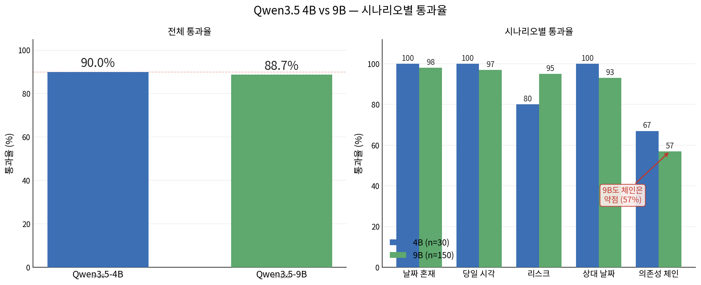

# TimeSorter — 한국어 할 일 우선순위 정렬 비서

> **Qwen3.5-4B / 9B**를 한국어 일정 관리 태스크에 특화 파인튜닝하는 SFT → DPO(→GRPO) 파이프라인.
> 할 일 목록을 **긴급도·중요도·의존성·시간 제약** 4축으로 채점해 우선순위를 결정합니다.

---

## 프로젝트 목적

스마트폰·PC에서 "오늘 할 일"을 입력하면 AI가 맥락을 이해해 실행 순서를 제안하는 개인 비서 코어 모델. 단순 키워드 정렬이 아니라, **페르소나**(직장인·학생·부모 등)와 **4축**으로 각 태스크를 1–5점 채점하고 근거를 함께 제시합니다.

```
입력: "임원 보고서 마감(내일), 팀 회의(오후 2시), 점심 약속, 메일 답장 3건"

출력:
1) 임원 보고서 마감  [긴급5·중요5·의존4·시간2] — 내일 마감, 핵심 업무
2) 팀 회의(오후 2시) [긴급4·중요4·의존3·시간4] — 고정 시각, 후속 블로킹
3) 메일 답장 3건     [긴급4·중요3·의존2·시간1] — 긴급하나 고정 시각 없음
4) 점심 약속         [긴급2·중요2·의존1·시간3] — 유연 조정 가능
```

출력은 항상 4축 점수 JSON (`tasks`/`priority_order`/`scores`/`refusal_reason`) — 앱이 바로 파싱·렌더링.

---

## 실험 결과

held-out 150 시나리오를 골격 규칙(`verify_chosen`)으로 $0·결정론 자동 채점. (지난 일정 순위·당일 시각 순서·체인 연속성·리스크 importance·무마감 1위)


### 모델별 통과율 (held-out)

| 모델 | 어댑터 | 전체 | Dated | Intraday | Risk | Relative | Chain | N |
|------|--------|------|-------|----------|------|----------|-------|---|
| Qwen3-4B-Instruct | DPO v3 | 56.7% | 38% | 67% | 95% | 100% | 30% | 150 |
| Qwen3-4B-Instruct | SFT v4 | 77.3% | 77% | 87% | 95% | 100% | 43% | 150 |
| Qwen3.5-4B | no adapter | 0.0% | 0% | 0% | 0% | 0% | 0% | 150 |
| **Qwen3.5-4B** | **SFT+DPO** | **85.3%** | 96% | 90% | 100% | 93% | 47% | 150 |
| **Qwen3.5-9B** | **SFT+DPO** | **88.7%** | 98% | 97% | 95% | 93% | 57% | 150 |



### 핵심 발견

| 단계 | 변화 | 원인 |
|------|------|------|
| DPO v3 → SFT v4 | 56.7% → **77.3%** (+20.6%p) | **데이터 큐레이션 + prompt loss 마스킹** |
| SFT → DPO | ±0 (체인 불변) | DPO는 선호 조정 — 능력 부재(체인)는 못 옮김 |
| 4B → 9B | 85.3% → **88.7%** (+3.4%p, n=150) | 모델 크기는 약점 평준화에만, 체인은 여전히 미해결 |

1. **성능 점프는 모델 구조가 아니라 데이터 품질·loss 마스킹에서.** DPO/GRPO 선호 학습 단독으로는 한계 약점을 못 옮긴다.
2. **파인튜닝의 1차 효과는 출력 스키마 준수.** no-adapter는 추론은 하지만(내용 34%) JSON 규격을 안 지켜 0% — SFT가 앱이 파싱할 규격으로 고정. ([상세](presentation/01_model_comparison/content_analysis.md))
3. **의존성 체인(47~57%)은 4B·9B 모두 미해결** — 모델 크기가 아닌 체인 SFT 데이터 보강이 필요.

> 상세 분석: [docs/VALIDATION.md](docs/VALIDATION.md) · 실험 보고서: [experiments/](experiments/) · 발표자료: [presentation/](presentation/)

---

## 학습 · 사용 방법

### 1. 환경 설정

```bash
make setup-dgx       # Linux CUDA (또는 setup-mac / docker-build)
```

`.env`:
```
OPENAI_API_KEY=sk-...   # 데이터 생성
HF_TOKEN=hf_...         # 모델·데이터 다운로드
HF_HOME=models          # 로컬 캐시
```

### 2. 데이터 준비

```bash
make download          # HF 데이터셋
make download-models   # Qwen3.5 가중치
```

데이터셋은 HF에 버전별로 공개: [SFT](https://huggingface.co/datasets/pieroot/timesorter-sft-ko) · [DPO](https://huggingface.co/datasets/pieroot/timesorter-dpo-ko)

### 3. 학습

```bash
uv run python scripts/train_sft.py    # SFT (Qwen3.5-4B, curated + loss 마스킹)
uv run python scripts/train_dpo.py    # DPO (on-policy + hard tier)
```

### 4. 추론 · 검증

```bash
# 추론
uv run python -m timesorter.infer --adapter outputs/dpo_q35_4b_v5 --schema-version v3 \
  --persona "직장인" --today 2026-06-15 \
  --prompt "보고서 마감(오늘 17시), 팀 회의(14시), 메일 답장 3건"

# 검증 (held-out 자동 채점)
bash scripts/validate_model.sh outputs/dpo_q35_4b_v5
```

학습 어댑터도 HF 공개: [SFT v4](https://huggingface.co/pieroot/timesorter-qwen3.5-4b-sft-v4) · [DPO v5](https://huggingface.co/pieroot/timesorter-qwen3.5-4b-dpo-v5)

---

## 문서

| 문서 | 내용 |
|------|------|
| [docs/DATASETS.md](docs/DATASETS.md) | 데이터셋 v1~v6 구성·차이·생성 방법 |
| [VERSIONING.md](VERSIONING.md) | 버전별 증분 규칙 · HuggingFace 사용법 |
| [docs/TRAINING.md](docs/TRAINING.md) | 학습 설정·하드웨어·검증·모듈 구조 |
| [docs/VALIDATION.md](docs/VALIDATION.md) | 상세 검증 분석·학습 지표 이력 |
| [docs/ROADMAP.md](docs/ROADMAP.md) | 개선 계획·남은 한계 |
| [docs/SETUP.md](docs/SETUP.md) · [docs/SERVING.md](docs/SERVING.md) | 환경 설정 · vLLM 서빙 |
| [experiments/](experiments/) | 실험별 상세 보고서 (RTX 12GB·4090 9B) |
| [presentation/](presentation/) | 발표자료 (PPT) + 모델 비교 분석 |
