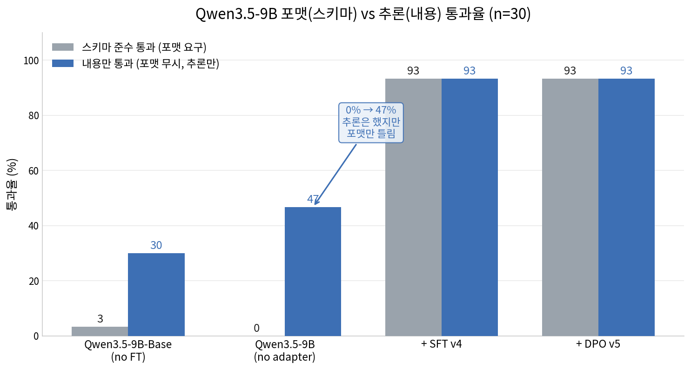

# 실험 결과: Qwen3.5-9B SFT+DPO — RTX 4090 단일 GPU, v4 데이터셋

## 실험 개요

| 항목 | 내용 |
|------|------|
| 모델 | Qwen/Qwen3.5-9B (베이스) |
| 학습 방식 | SFT → DPO 2단계 파인튜닝 |
| 데이터셋 | v4 (schema_version: v3, `<<TODAY>>` 날짜 주입) |
| GPU | RTX 4090 × 1 (24GB VRAM), CUDA_VISIBLE_DEVICES=0 |
| 메모리 최적화 | 4-bit QLoRA (NF4), adamw_8bit, gradient_checkpointing |
| 날짜 | 2026-06-12 ~ 2026-06-13 |

---

## 1단계: SFT (Supervised Fine-Tuning)

### 설정

```yaml
# configs/sft_4090_1x_9b_v4.yaml
model_name: Qwen/Qwen3.5-9B
dataset: data/sft_v4_train.parquet
output_dir: outputs/sft_4090_1x_9b_v4
max_seq_length: 1536
schema_version: "v3"
lora:
  r: 16
  alpha: 32
  dropout: 0.05
  use_4bit: true
training_args:
  per_device_train_batch_size: 1
  gradient_accumulation_steps: 32   # 유효 배치: 32
  num_train_epochs: 3
  learning_rate: 2.0e-5
  packing: true
  optim: adamw_8bit
  gradient_checkpointing: true
```

### 실행 명령

```bash
CUDA_VISIBLE_DEVICES=0 uv run python scripts/train_sft.py \
  --config configs/sft_4090_1x_9b_v4.yaml
```

### 결과

| 지표 | 값 |
|------|----|
| 데이터셋 | 6,056 샘플 |
| 학습 스텝 | 513 steps (3 epochs) |
| 최종 train_loss | 0.3199 |
| token accuracy | 91.5% |
| 소요 시간 | 약 11.5시간 |
| VRAM 사용 | ~22 GB |
| 어댑터 크기 | 56 MB |

### 체크포인트

```
outputs/sft_4090_1x_9b_v4/
├── adapter_model.safetensors   (56 MB)
├── adapter_config.json
├── tokenizer.json
├── chat_template.jinja
├── checkpoint-171/
├── checkpoint-342/
└── checkpoint-513/
```

---

## 2단계: DPO (Direct Preference Optimization)

### 설정

```yaml
# configs/dpo_4090_1x_9b_v4.yaml
model_name: Qwen/Qwen3.5-9B
sft_adapter: outputs/sft_4090_1x_9b_v4
dataset: data/dpo_pairs_v4_extra.parquet
output_dir: outputs/dpo_4090_1x_9b_v4
max_prompt_len: 300
schema_version: "v3"
lora:
  r: 16
  alpha: 32
  dropout: 0.05
  use_4bit: true
training_args:
  per_device_train_batch_size: 1
  gradient_accumulation_steps: 32
  num_train_epochs: 1
  max_length: 1280               # OOM 방지: 1536 → 1280
  precompute_ref_log_probs: true
  precompute_ref_batch_size: 1
  beta: 0.1
  learning_rate: 5.0e-7
  optim: adamw_8bit
  gradient_checkpointing: true
  gradient_checkpointing_kwargs:
    use_reentrant: false
```

### 실행 명령

```bash
PYTORCH_CUDA_ALLOC_CONF=expandable_segments:True CUDA_VISIBLE_DEVICES=0 \
  uv run python scripts/train_dpo.py \
  --config configs/dpo_4090_1x_9b_v4.yaml
```

### OOM 해결 과정

| 시도 | max_length | max_prompt_len | 결과 |
|------|-----------|----------------|------|
| 1차 | 1536 | 800 | OOM (21.69 GB 점유, 1.42 GB 부족) |
| 2차 | 1024 | 800 | 전체 샘플 필터됨 (response cap=224 < 실제 max=885) |
| 3차 | 1536 + expandable_segments | 800 | 여전히 OOM |
| **4차** | **1280** | **300** | **성공** (response cap=980, 전 샘플 통과) |

### 학습 곡선

| epoch | loss | rewards/accuracies | rewards/margins |
|-------|------|-------------------|-----------------|
| 0.16 | 0.6921 | 0.550 | 0.0027 |
| 0.32 | 0.6699 | 0.803 | 0.0479 |
| 0.49 | 0.6549 | 0.841 | 0.0795 |
| 0.65 | 0.6493 | 0.888 | 0.0913 |
| 0.81 | 0.6457 | 0.884 | 0.0990 |
| 0.97 | 0.6502 | 0.847 | 0.0898 |

**핵심 지표:** rewards/accuracies 0.55 → 0.88 (+60%), rewards/margins 0.003 → 0.099 (+33×)

### 소요 시간

| 단계 | 시간 |
|------|------|
| ref log probs precompute | 약 27분 |
| DPO backward (62 steps) | 약 90분 |
| 전체 | 약 2.5시간 |

---

## 3단계: Docker 검증 (골격 규칙 자동 채점)

### 검증 환경

```bash
docker run --rm --gpus '"device=0"' \
  -v $PWD/models:/root/.cache/huggingface \
  -v $PWD/outputs:/workspace/outputs \
  -v $PWD/data:/workspace/data \
  -v $PWD/src:/workspace/src \
  -v $PWD/scripts:/workspace/scripts \
  -e ADAPTER=outputs/dpo_4090_1x_9b_v4 \
  -e EVAL_SET=data/scheduler_v3_eval.parquet \
  timesorter:cu124 \
  bash -c "/root/.local/bin/uv pip install -q 'transformers>=5.0' 'peft>=0.14' && \
           python /workspace/scripts/docker_validate_dpo.py"
```

- 추론 설정: `enable_thinking=False`, `max_new_tokens=1536`, `do_sample=False`
- 평가셋: `data/scheduler_v3_eval.parquet` (150개 held-out 시나리오, seed=47)
- 채점 기준: `verify_chosen()` — 지난 일정 순위, 당일 시각 순서, 체인 연속성, 리스크 importance, 무마감 1위 금지

### 전체 결과

```
전체 통과율: 133/150 = 88.7%
```

### 시나리오별 통과율

| 시나리오 | 통과 | 전체 | 통과율 |
|----------|------|------|--------|
| v3_dated_mixed | 52 | 53 | **98%** |
| v3_intraday | 29 | 30 | **97%** |
| v3_risk | 21 | 22 | **95%** |
| v3_relative | 14 | 15 | **93%** |
| v3_dependency_chain | 17 | 30 | **57%** ⚠️ |
| **전체** | **133** | **150** | **88.7%** |

### 위반 유형별 집계 (17건)

| 위반 유형 | 건수 | 설명 |
|-----------|------|------|
| chain (체인 순서/연속성) | 20 | 선행 의존 태스크의 순서·연속 배치 미흡 |
| intraday_order (당일 시각 순서) | 2 | 같은 날 마감 시각 순서 역전 |
| none_first (무마감 1위) | 1 | 마감 없는 태스크가 최우선 배치 |
| past_rank (지난 일정 순위) | 1 | 이미 지난 태스크가 유효 태스크보다 상위 |

> **분석:** 전체 위반 24건 중 20건(83%)이 `dependency_chain` 시나리오에서 발생.
> 체인 태스크 처리가 현재 모델의 주요 약점이며, 나머지 4가지 시나리오(dated_mixed·intraday·risk·relative)는 93~98%로 매우 높은 수준.

### 정성 평가 — 샘플 추론

**입력 (직장인, 오늘: 2026-06-13):**
```
- 보고서 제출 (2026-06-13 17:00까지)
- PR 리뷰 (2026-06-13 오전까지, 미처리 시 팀장 에스컬레이션)
- 회의 자료 정리 (2026-06-12 14:00 회의, 아직 미완료)
- 책상 정리
- 팀 점심 예약 (2026-06-13 12:00 이전)
```

**출력 (priority_order: [2, 5, 1, 3, 4]):**
```
1위. PR 리뷰  [U=5 I=5 D=1 T=5]  ← 오전 마감 + 에스컬레이션
2위. 팀 점심 예약  [U=4 I=3 D=1 T=4]  ← 12:00 이전 시간 제약
3위. 보고서 제출  [U=4 I=3 D=1 T=4]  ← 17:00 마감
4위. 회의 자료 정리  [U=1 I=2 D=1 T=1]  ← 어제 회의 (지난 일정)
5위. 책상 정리  [U=1 I=1 D=1 T=1]  ← 마감 없음
```

**판정:** ✅ 올바름
- PR 리뷰를 1위로 배치 (오전 마감 + 에스컬레이션 리스크)
- 점심 예약을 보고서보다 앞에 배치 (12:00 시간 제약이 17:00보다 빠름)
- 지난 일정(어제 회의)을 하위 배치
- 무마감 태스크(책상 정리)를 최하위 배치

---

## 4-way 검증 (base / no-sft / SFT / DPO, n=30)

4B와 동일 방식으로 학습 단계별 통과율을 측정 (RTX 3080 Ti 12GB 4-bit 추론, `scripts/benchmark_9b.py`).
스키마 준수(포맷 요구) vs 내용만(포맷 무시, tasks id 재구성 후 채점) 분리.

| 모델 | 스키마 통과 | 내용 통과 |
|------|-----------|----------|
| Qwen3.5-9B-Base (no FT) | 3.3% | 30.0% |
| Qwen3.5-9B (no adapter) | 0.0% | **46.7%** |
| + SFT v4 | **93.3%** | 93.3% |
| + DPO v4 | **93.3%** | 93.3% |

- **no-adapter 0%는 포맷 문제** — 내용만 보면 46.7%(리스크 4/5·상대날짜 4/4는 추론 정답, 포맷만 미준수). 4B(43.3%)와 동일한 패턴.
- **SFT=DPO 완전 동일**(체인 4/6 고착) — DPO가 체인을 전혀 옮기지 못함. 4B와 동일.
- SFT/DPO 시나리오별(n=30): 날짜혼재·당일시각·리스크·상대날짜 모두 100%, **체인만 67%(4/6)**.

> n=30(4-way)은 빠른 비교용. n=150 전체 평가에서 DPO는 88.7%(체인 57%) — 표본이 클수록 체인 약점이 더 뚜렷.



## 주요 발견 및 한계

### 잘 된 점
- **4-bit QLoRA로 24GB VRAM 내 9B 모델 학습 성공** (SFT 11.5h + DPO 2.5h)
- **4가지 시나리오 93~98% 통과율**: 날짜 혼재(dated_mixed), 당일 스케줄(intraday), 리스크(risk), 상대 날짜(relative)
- DPO를 통해 rewards/accuracies가 55% → 88%로 향상 (선호도 학습 효과 명확)
- 정성 평가에서 에스컬레이션 리스크, 시간적 임박도, 지난 일정 처리 모두 올바름

### 개선 필요
- **dependency_chain 시나리오 57%**: 다단계 선행-후행 체인 태스크의 순서 및 연속 배치 학습 부족
  - 근본 원인: DPO 학습 데이터에서 체인 위반 패턴에 대한 rejected 쌍이 부족할 가능성
  - 개선 방향: 체인 시나리오 전용 DPO 쌍 추가 생성, 또는 GRPO로 `verify_chosen()` 직접 최적화

### 기술적 특이사항
- Qwen3.5-9B 추론 시 `enable_thinking=False` 필수: 미설정 시 영어 reasoning 텍스트로 max_new_tokens 소진
- `prompt_completion: true` SFT는 base 토크나이저 불일치로 전 샘플 폴백(full-sequence loss) 발생
- DPO `max_length=1536` → OOM, `1280`으로 해결 (attention O(n²) 스케일로 ~31% activation 메모리 절감)

---

## 재현 방법

```bash
# 1. 학습 환경 준비
git clone https://github.com/jung-geun/TimeSorter
cd TimeSorter
make download   # v4 데이터셋 다운로드

# 2. SFT
CUDA_VISIBLE_DEVICES=0 uv run python scripts/train_sft.py \
  --config configs/sft_4090_1x_9b_v4.yaml

# 3. DPO
PYTORCH_CUDA_ALLOC_CONF=expandable_segments:True CUDA_VISIBLE_DEVICES=0 \
  uv run python scripts/train_dpo.py \
  --config configs/dpo_4090_1x_9b_v4.yaml

# 4. 검증
docker run --rm --gpus '"device=0"' \
  -v $PWD/models:/root/.cache/huggingface \
  -v $PWD/outputs:/workspace/outputs \
  -v $PWD/data:/workspace/data \
  -v $PWD/src:/workspace/src \
  -v $PWD/scripts:/workspace/scripts \
  -e ADAPTER=outputs/dpo_4090_1x_9b_v4 \
  -e EVAL_SET=data/scheduler_v3_eval.parquet \
  timesorter:cu124 \
  bash -c "/root/.local/bin/uv pip install -q 'transformers>=5.0' 'peft>=0.14' && \
           python /workspace/scripts/docker_validate_dpo.py"
```

---

## 파일 목록

| 파일/디렉토리 | 설명 |
|--------------|------|
| `configs/sft_4090_1x_9b_v4.yaml` | SFT 설정 |
| `configs/dpo_4090_1x_9b_v4.yaml` | DPO 설정 |
| `outputs/sft_4090_1x_9b_v4/` | SFT 어댑터 (56MB) |
| `outputs/dpo_4090_1x_9b_v4/` | DPO 어댑터 (56MB) |
| `outputs/validation_dpo_v4.json` | 검증 상세 결과 (150개 샘플) |
| `logs/sft_4090_1x_9b_v4.log` | SFT 학습 로그 |
| `logs/dpo_4090_1x_9b_v4.log` | DPO 학습 로그 |
| `logs/validation_dpo_v4.log` | Docker 검증 로그 |
| `scripts/docker_validate_dpo.py` | Docker 검증 스크립트 |
